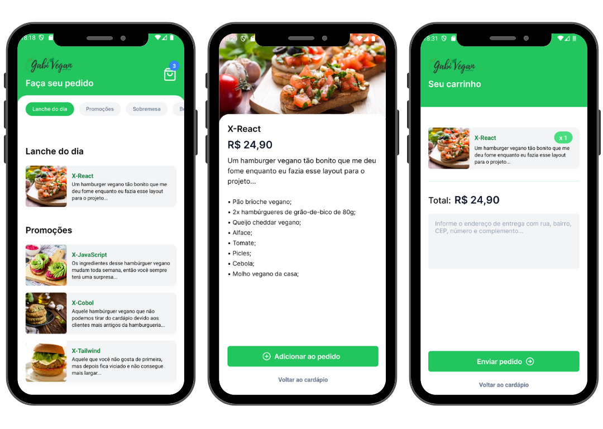

# Gabi Vegan App - React Native

## Description
This is a mobile application for vegan food delivery. The project uses React Native to build a responsive and intuitive user interface for a delivery service. I am publicly providing only the first stage of the interface creation, the rest of the implementation and integrations will continue in the private repository for the client's security and privacy.

<center></center>

## Features
- Listing of available dishes
- Adding dishes to the cart
- Sending the order via WhatsApp
- Completing orders with payment method
- Login with user and password integrated with Firebase authentication
- Integration with PagSeguro for pix and credit card payments

## Technologies Used
- **React Native:** Framework for mobile app development.
- **TypeScript:** Language used for static typing.
- **Tailwind CSS:** CSS framework for styling.
- **Firebase:** Serverless for data integrations.
- **REST API:** Backend to provide restaurant and order data.

## Installation
1. Clone the repository:
    ```bash
    git clone git@github.com:renatokhael/app-gabivegan.git
    ```
2. Navigate to the project directory:
    ```bash
    cd app-gabi-vegan
    ```
3. Install the dependencies:
    ```bash
    npm install
    ```

## Usage
1. Start the application:
    ```bash
    npm start
    ```
2. Use an emulator or a physical device to test the app.

## Contribution
Contributions are welcome! Feel free to open issues and pull requests.

## License
This project is licensed under the MIT license. See the [LICENSE](LICENSE) file for more details.
